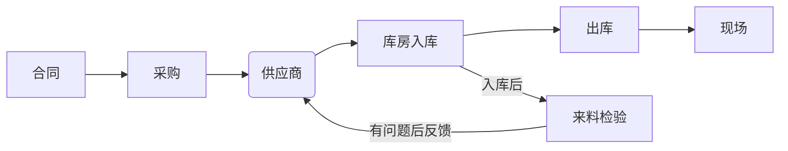

---
vlook-chp-autonum:h1{{#none#}},h2{{#none#}},h3{{#none#}},h4{{#none#}},h5{{#none#}}
vlook-welcome:一朝春尽红颜老，花落人亡两不知
vlook-doc-lib: 
- [文库](时间性汇总.html "教程")
- [教程](README.html)
- [工作问题](未处理问题.html)
---

[TOC]

# 
 每日安排计划清单

*时时调整的计划`A`*   记录和跟进自身日常生活与工作的清单与记录。

*详细内容`A`*_~Gn~_   分为生活、工作、游戏，技能和记录等模块，每个模块记录分门别类进行记录，记录的目的是提醒和提升自己。

> **欲望与能力不匹配，才会不快乐。**

> 文档的初心是为了记录和提醒，最重要的是在琐碎中找到出路，在记录中认识生活，而并非浑浑噩噩的度过每一天。

## 生活

*用于规范生活习惯`A`*  鉴于生活习惯不好，此模块主要用于规范生活习惯和当做日常备忘录

### 生活习惯和相关规划

> 该规范应当坚决执行，可根据具体情况具体调整，但应该日常遵守

*==良好习惯_努力匹配自己的欲望_==*

|                 规范                  |                    备注                    |      注意事项      |
| :-----------------------------------: | :----------------------------------------: | :----------------: |
| 睡眠时间应当保持在6小时及以上_~Aq!~_  |  根据8:30上班，最晚睡觉时间应当是凌晨1:00  | 起床时间应当在7:20 |
| 日常饮食保持早饭午饭，晚饭不吃_~Aq!~_ | 早上自己做饭，午餐选择==剁椒面==或==杂柯== |  周末午餐自行决定  |
|        日常刷牙洗漱保持_~Aq!~_        |            早晚各一次，睡前洗漱            |  在忙也要记得洗漱  |
|          定期清理卫生_~Aq!~_          | 包含房间清理，衣物洗涤，一到两周换鞋刷鞋等 |     每周末进行     |
|            每日锻炼_~Aq!~_            |        具体锻炼内容规划在其他模块内        |      每天坚持      |

良好习惯应当养成。

#### 具体计划

*详细计划`A`*  💪不同习惯的计划内容，坚持并适度调整

*==运动锻炼计划表==*

|  星期  |               锻炼内容               |                   注意事项                   |
| :----: | :----------------------------------: | :------------------------------------------: |
| 星期一 |    跑步2公里起步+哑铃全身运动一组    | 先哑铃全身运动，再去跑步锻炼，锻炼后回来拉伸 |
| 星期二 |    跳绳运动一组+哑铃全身运动一组     |     先跳绳后哑铃全身运动，运动后轻微拉伸     |
| 星期三 |        跑步2公里起步+腹肌训练        |        先腹肌训练再去跑步，跑步后拉伸        |
| 星期四 |          跳绳运动+深蹲训练           |        先深蹲训练，后跳绳，运动后拉伸        |
| 星期五 |    看情况进行具体的训练，建议跑步    |                                              |
| 星期六 | 自适应性的去进行训练或休息，建议跑步 |                                              |
| 星期日 |                 休息                 |                     休息                     |

​	上述内容根据天气和身体训练情况适当调整，贵在坚持和努力

> 🥗饮食方面需要做到更多的控制，尽量配合睡眠时间，调整作息，自己做饭吃饭，均衡营养

*==饮食选择==*

|  时间  |           早餐            |       午餐       |         晚餐          |
| :----: | :-----------------------: | :--------------: | :-------------------: |
| 工作日 |   牛奶🥛（酸奶）泡燕麦片   | 剁椒面加面🍜+蛋🥚  | 火烧+豆腐皮+鸡蛋+香肠 |
|   :    |          蒸鸡蛋🥚          |   杂珂或黄焖鸡   |         水果          |
|   :    |      荷包蛋🍳+火腿肠       |       待定       |         待定          |
| 休息日 | 胡辣汤+小笼包（去外面买） |    米饭+炒菜     |         水果          |
|   :    |   煎鸡蛋+ 火腿+牛奶燕麦   | 方便面+腊肠+油馍 |      清煮荞麦面       |

## 技能

## 记录

*内容`A`* 用于记录日常生活发声的事，一些错误，一些优美的句子，值得记录事情，用于警醒，用于提醒自己，用于回忆美好。

## 工作

### 工作内容确认和明晰

*当前工作内容与职责的明细`A`*  用于对工作的进一步定位，确认自己的工作职责

除当前工作内容外，配合其他同事工作，处理杂项

> **当前工作内容**

目前仍在学习和巩固中，当前工作内容较少，后续主要工作内容是模块测试相关

---

> **线束相关**
>
> - 线束需求的转达
> - 对线束数据进行更新和管理
> - 申请物料号，下采购单（正在学习）

> **测试相关**
>
> - 主要是模块测试
> - 学习模块测试内容，后续接替应龙哥
> - 待定

- 线束工作后续就不需要转达，主要在来料检验后，将问题反馈给供应商

*==线束采购流程==*

### 工作注意事项

*工作注意`A`* 在工作中，应该逐渐学习，将工作越做越轻松，有点颜色，体现自己的作用，不要一件事干不成，不要事事失败

> **事项相关和错误记录**
>
> > ###### 1.保密性
> >
> > - 在工作中保持保密性，不得将工作内容泄露，做好工作内容的保密性
>
> > ###### 2.对信息进行过滤
> >
> > - 当进行信息传递时，应该考虑备全传递信息，对信息进行过滤处理，让领导省心省事
> > - 要学会举一反三，将内容补全并多考虑深层，多去做事
> >
> > 错误：2024.10.10传递腾河线束订单时，没有问全是否能全部发货，没有思考全面
>
> > ###### 3.不确定的事情，直接去问清楚，确定后再反馈
> >
> > - 对于不确定的发货地点，或者不确定的要求事项，不要根据自己的想法来，不要怕麻烦领导，直接问，问清楚，不问清楚反而会影响更多，一定要多和领导沟通，不要害怕被沟通

