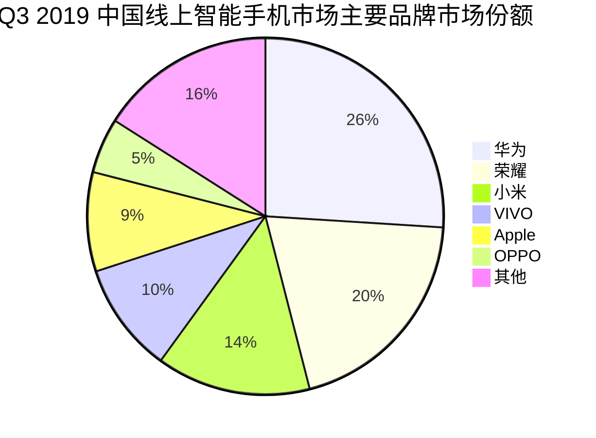

[TOC]

# 问题笔记

关于问题需要进行记录，该文档目的就是这个。[^1]_~Rd~_

## 测试用法

[点击这里打开默认文库](?target=vdl)

*==线上饼图_来源于网络_==*

```mermaid
pie title Q3 2019 中国线上智能手机市场主要品牌市场份额
"华为" : 26
"荣耀" : 20
"小米" : 14
"VIVO" : 10
"Apple" : 9
"OPPO" : 5
"其他" : 16
```

[^1]:就是测试的注释
